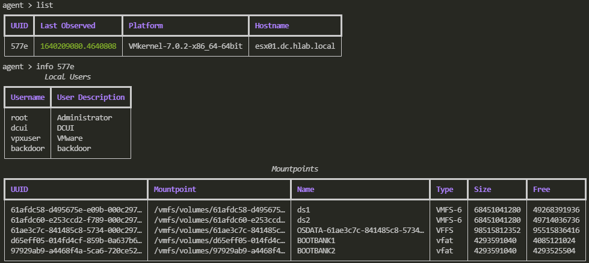

# REAVE


[](https://www.repostatus.org/#wip)
[](https://github.com/psf/black)
[](https://github.com/Psmths/reave/actions?query=workflow%3ACodeQL)

Reave is a post-exploitation framework tailored for hypervisor environments. It is currently under development. 

Reave follows a traditional listener/agent model, where the user may set up multiple listeners of various flavors that accept any number of agents, each agent intended to be executed on a hypervisor host. The framework currently provides a Python agent and supports the following objectives:

 - Automatic enumeration of hypervisor hosts, including:
   - What guest systems are installed
   - What network shares are mounted (NFS/iSCSI)
   - What local users are associated
   - What domain the hypervisor is a part of
   - What datastores exist on the physical system
 - Modular payloads supporting capabilities such as:
   - Exfiltration: of datastores, files, virtual disks.
   - Persistence: Adding, modifying, deleting local users, installing SSH keys and reverse shells
   - Enumeration: Further network scanning, etc. 

The goal of Reave is to provide a framework one can leverage to automate and expedite pentesting campaigns in environments that are either heavily virtualized, or where target/critical infrastructure is hosted on hypervisor platforms such as ESXi and Proxmox. 

# Screenshots
### Listener context

### Payload context

### Automatic Enumeration


# Command Line Interface

The command line has three distinct contexts:

 - Listener
 - Payload
 - Agent

## Listener Context Commands

To enter the listener context, use command `listener`. From there, several options are available:

```
list                            List all active listeners
add <host> <port> <secret>      Add a listener
remove <uuid>                   Remove a listener
```

Exit this context by using command `back`

## Agent Context Commands

To enter the agent context, use command `agent`. From there, several options are available:

```
list                    List all agents
interact <uuid>         Interactive terminal session with agent. 
                        'quit' to exit.
create                  Start creating a new agent script.
                        Will write to ./data/ directory
```

Exit this context by using command `back`

## Payload Context Commands

To enter the `payload` context, use command `payload`. From there, several options are available:

```
list                    List all loaded payloads
info <name>             Get information about a payload
use <name>              Select payload for use
set <option> <value>    Set payload option to value
run agent <uuid>        Run the payload on an individual agent
run listener <uuid>     Run the payload on all agents on the listener
```

Exit this context by using command `back`

# Contributors

  - [desultory](https://github.com/desultory)
