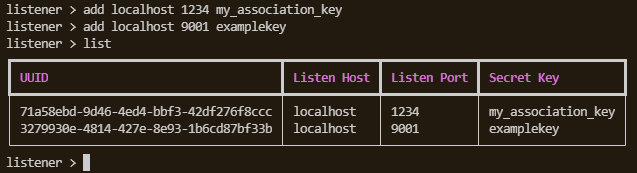
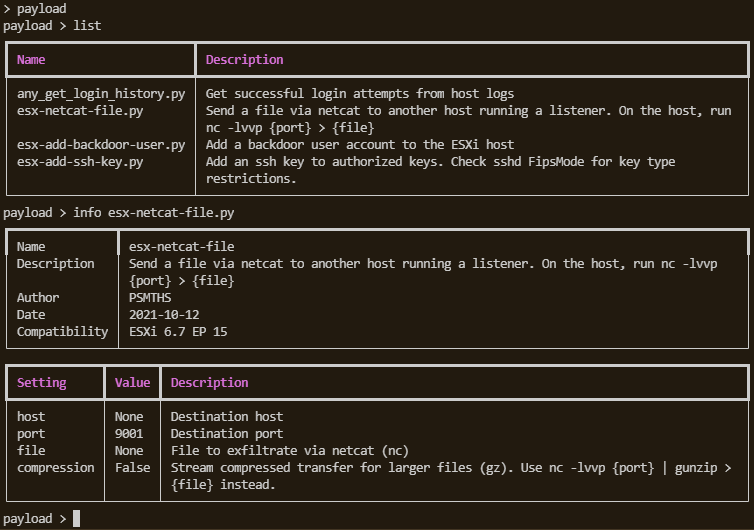
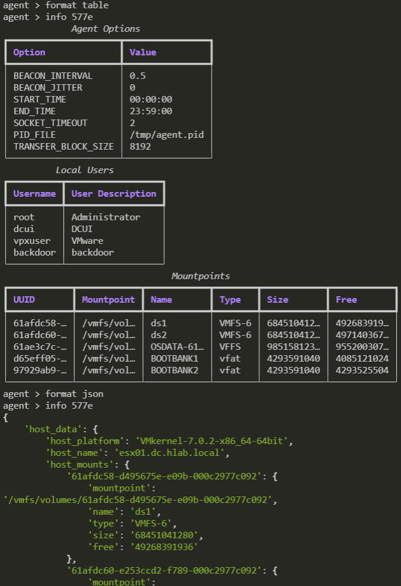
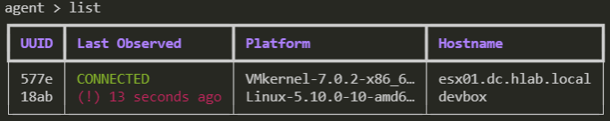

<p align="center">
  <h2 align="center">REAVE</h2>
</p>

<p align="center">
  
  
  
  
  
</p>
<hr>

Reave is a post-exploitation framework tailored for hypervisor endpoints. It is currently under development. 

Reave follows a traditional listener/agent model, where the user may set up multiple listeners of various flavors that accept any number of agents. The framework currently provides a Python agent and supports the following objectives:

 - Interactive terminal sessions
 - Automatic enumeration of hypervisor hosts, including:
   - What guest systems are installed
   - What network shares and datastores are mounted
   - What local users are associated
   - What domain the hypervisor is a part of
 - Modular payloads supporting capabilities such as:
   - Exfiltration: of datastores, files, virtual disks.
   - Persistence: Adding, modifying, deleting local users, installing SSH keys and reverse shells
   - Enumeration: Further network scanning, etc. 

The goal of Reave is to provide a framework one can leverage to automate and expedite pentesting campaigns in environments that are either heavily virtualized, or where target/critical infrastructure is hosted on hypervisor platforms such as ESXi and Proxmox. 

# Screenshots

<p align="center">
  
</p>
<h3 align="center"><i>Listener Context</i></h3>

<p align="center">
  
</p>
<h3 align="center"><i>Payload Context</i></h3>

<p align="center">
  
</p>
<h3 align="center"><i>Automatic Hypervisor Enumeration</i></h3>

<p align="center">
  
</p>
<h3 align="center"><i>Centralized C2 Overview</i></h3>

# Usage

On the server, simply run app.py:

```
python3 reave/app.py
```

On your client of choice, upload `reave/agents/client.py` and run the file. The following configuration options are available:

 - `_LISTENER_HOST` Hostname/IP of the server
 - `_LISTENER_PORTS` List of ports that the agent will attempt to connect to in round-robin fashion
 - `_LISTENER_SECRET` Association key of the listener the agent will bind to
 - `_AGENT_LOGLEVEL` Debug logging level
 - `BEACON_INTERVAL` Interval the agent will beacon on
 - `BEACON_JITTER` Random jitter factor added to beacon interval
 - `START_TIME` What time of day the agent will start beaconing 
 - `END_TIME` What time of day the agent will stop beaconing
 - `SOCKET_TIMEOUT` Timeout for the agent's socket
 - `PID_FILE` PID file the agent uses to ensure it isn't already running on the endpoint 
 - `TRANSFER_BLOCK_SIZE` Block size the agent will use when transfering files to the server 

# Command Line Interface

The command line has three distinct contexts:

 - Listener
 - Payload
 - Agent

## Listener Context Commands

To enter the listener context, use command `listener`. From there, several options are available:

```
list                            List all active listeners
add <host> <port> <secret>      Add a listener
remove <uuid>                   Remove a listener
```

Exit this context by using command `back`

## Agent Context Commands

To enter the agent context, use command `agent`. From there, several options are available:

```
list                    List all agents
interact <uuid>         Interactive terminal session with agent. 
                        'quit' to exit.
create                  Start creating a new agent script.
                        Will write to ./data/ directory
get <uuid> <file>       Transfer file from the agent endpoint to downloads directory
```

Exit this context by using command `back`

## Payload Context Commands

To enter the `payload` context, use command `payload`. From there, several options are available:

```
list                    List all loaded payloads
info <name>             Get information about a payload
use <name>              Select payload for use
set <option> <value>    Set payload option to value
run agent <uuid>        Run the payload on an individual agent
run listener <uuid>     Run the payload on all agents on the listener
```

Exit this context by using command `back`

## Formatting Selection

Reave also supports defining what format you would like to view enumeration data in. To switch to a particular format:

```
format json             Output information in table format.
format table            Output information in JSON format.
```

# Contributors

  - [desultory](https://github.com/desultory)
